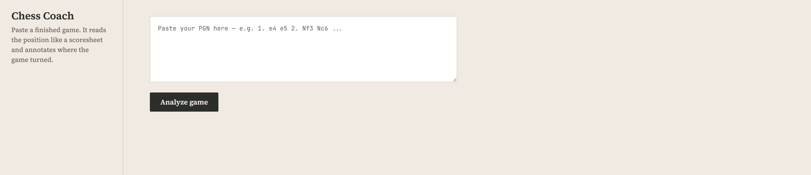
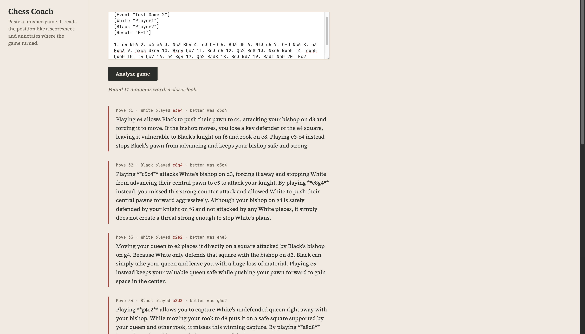

# Chess Coach

Give it a finished chess game, it tells you where you screwed up and why — not just "you lost material," actual coaching explanations.

I play chess seriously enough to know when an explanation is actually right, so this was an easy pick for a personal GenAI project — I could tell immediately if the output was good or just sounded good.

## What it actually does

You paste a game (in PGN, the standard chess notation format) into the web page. The app:

1. Replays the game move by move using Stockfish (a free, extremely strong chess engine)
2. Flags the moments where the evaluation swings hard — those are the real mistakes
3. Checks the actual board facts around that move (what's defending what) using the `python-chess` library
4. Sends those verified facts, along with the position, to Gemini, and asks it to explain the mistake in plain language
5. Shows you the result




## Why it's split into two parts

Gemini is decent at explaining chess in words, but it's bad at actually calculating chess — it'll straight up get board facts wrong if you let it "figure out" the position itself.

So it doesn't get to guess anything:

- **Stockfish** does all the actual calculation — best moves, evaluations. Pure math, never wrong.
- **Gemini** only writes the explanation. It gets handed the facts, it doesn't work them out.

Basically: don't trust the LLM with anything you can calculate yourself. Only let it do the part it's actually good at — words.

## The bug that actually mattered

Gemini called a pawn "undefended" when it wasn't — there was a queen sitting right behind the bishop guarding it, same diagonal. It just didn't see it, because it was pattern-matching, not actually reading the position properly.

Could've patched it with a better prompt ("hey double check your work") but that doesn't actually guarantee anything — it just makes the model guess more carefully, still a guess. So instead I made the code itself check every square for backup defenders (queen behind bishop, rook behind rook, that kind of thing — chess players call this a battery/x-ray) and just hand Gemini the real answer. Now it's not guessing that fact at all.

If the tool can't get something this basic right, nothing else it says about that position is trustworthy either — so this wasn't optional to fix.

## Other stuff that broke

- **Checkmate scores were faking out my mistake detector.** Stockfish scores mate completely differently from a normal position, so my code saw the jump into a mate score and flagged it as a huge blunder — even though the game was just ending normally. Had to special-case anything near a mate score.
- **Gemini's free tier caps you at 20 requests/day, 5/minute.** Hit both. Added a delay between calls, and made it fail without crashing if the daily quota runs out mid-analysis instead of just dying.
- **Same position, run twice, doesn't always get the same wording back.** Not wrong, just not consistent. Not fixing this — it's just how these models generate text, not a bug in my code.

## Did I actually check it works

Yeah — checked a sample by hand against real boards on Lichess, since I play chess and can actually tell if an explanation is bs or not.

- Checked 6 flagged explanations in detail.
- Found 1 wrong (the defended-pawn thing above) → led to the fix.
- Re-checked that case plus 3 related ones after the fix — all correct.

Not claiming I checked everything — this is a sample, not a full eval. But it's real, and I know exactly what I did and didn't check.

## What this can't do

- It can't reliably judge deeper strategic ideas — only fairly direct tactical mistakes (hanging pieces, missed captures, king safety issues) where the evaluation swings hard.
- Explanations can occasionally be inconsistent in wording between runs.
- Limited by Stockfish's short "thinking time" per move (0.2–0.3 seconds) to keep analysis fast — a longer think time would catch more subtle mistakes, at the cost of speed.
- Free-tier API limits mean heavy testing needs to be spread out, or paid billing enabled.

## How it's built

- **Backend:** Python, FastAPI, `python-chess`, Stockfish (installed locally), Gemini API (`google-genai`)
- **Frontend:** plain HTML/CSS/JS, no framework — talks to the backend over a local API call

## Running it

```
# backend
python -m uvicorn server:app --reload

# then open index.html in a browser
```

You'll need Stockfish installed (`brew install stockfish` on Mac) and a Gemini API key in a `.env` file:
```
GEMINI_API_KEY=your_key_here
```
